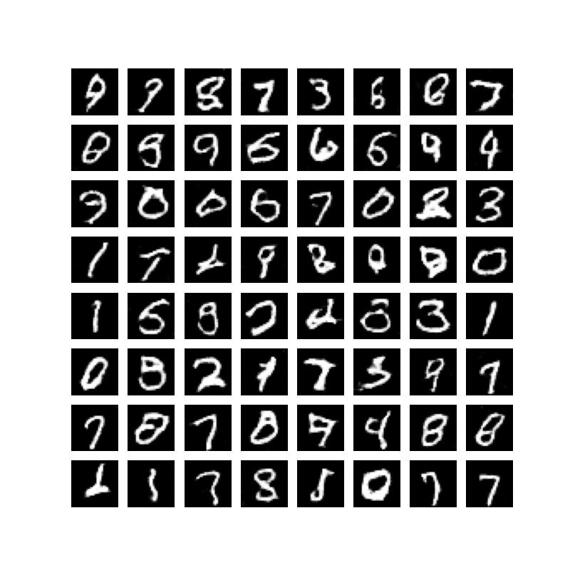

# Vanilla GAN
* The following is an implementation based on the original GAN paper by Goodfellow
* We have implemented both the CNN based and FFN based GANs
* We have done many experiments to get the thing working, only the final details are included in this file

## Training Datset
* Only MNIST Dataset was used to test due to compute constraint. 

## Architecture Details
### FC
* 4 layers of FFN in Generator (100 dimensional random noise vector, 100,32*8,64*8,128*8,784)   
* 4 layers of FFN in Discriminator (784, 64*8, 32*8, 4*8,1,) )
* LeakyRelu for both discriminator and generator, inspired from DCGAN
* Tanh output activation for Generator and Sigmoid for the discriminator

### CNN
* 4 layers of ConvTranspose in Generator (25 d vector of random noise, 28*4, 28*2, 28*1, 1  channels, maintains spatial dimension of image at each layer, kernel_size=4,padding=2)
* 4 layers of Conv in Discriminator (1, 28*1, 28*2, 28*3  channels, maintains spatial dimension of image at each layer,kernel_size,padding=2)
* LeakyRelu for both discriminator and generator, inspired from DCGAN
* Tanh output activation for Generator and Sigmoid for the discriminator
* BatchNorm2d at every layer except output and input layers  

## Inference
* We simply run the trained generators to produce images from random noise

## Psuedocode(Training)
* Take an image(MNIST)
* We feed  this to discriminator and run forward pass
* Backprop on the loss to maximize the probability of correctly identifying this images
* Generate same number of images from Genrator using random noise
* Send this images to discriminator, run backprop to minimize the probability of correctly identifying these images.

## Training Details
* Input is normalized to 0 mean ,1 variance
* Trained for 5  epochs on colab RAM
* Not evaluated using FID, IS score

## Samples Generated
 
 
## Future changes/work
* Cleaning the code to make it more readable and efficient
* Trying softmax by quantization of pixel
* Scaling the method to generate color image (We have done it on GPT)
* Implementing other variants of GAN
* Using GAN for other generative proccess
* HyperParameter Search
